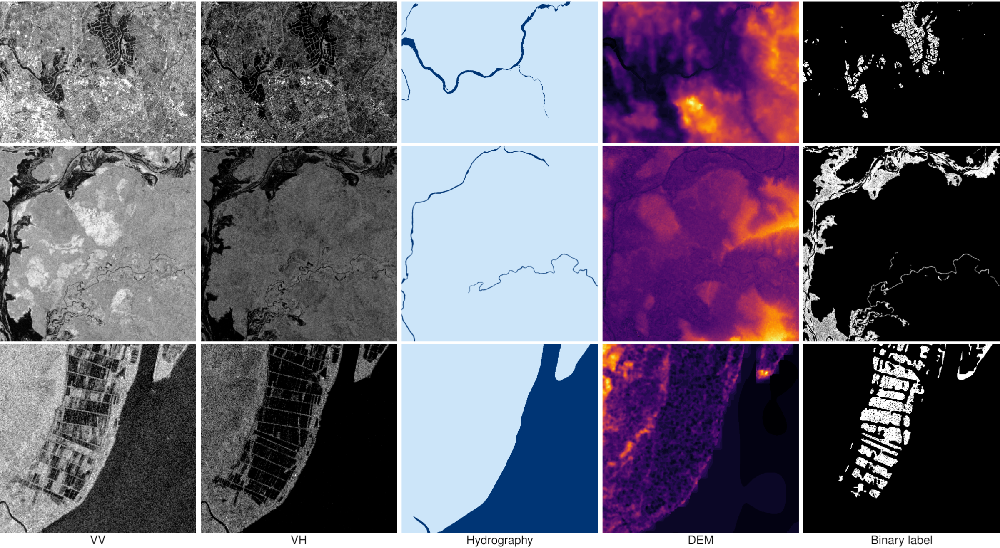

# MMFlood: A Multimodal Dataset for Flood Delineation from Satellite ImageryFlood delineation from Sentinel-1 SAR imagery.

Code and data access for the MMFlood dataset.

**Last update: 05-2022**



## Dataset Access and Specifications

You can download the MMFlood dataset from Zenodo, at the following link: [https://zenodo.org/record/6534637](https://zenodo.org/record/6534637)

### Structure
The dataset is organized in directories, with a JSON file providing metadata and other information such as the split configuration we selected.
Its internal structure is as follows:

```
activations/
├─ EMSR107-1/
├─ .../
├─ EMSR548-0/
│  ├─ DEM/
│  │  ├─ EMSR548-0-0.tif
│  │  ├─ EMSR548-0-1.tif
│  │  ├─ ...
│  ├─ hydro/
│  │  ├─ EMSR548-0-0.tif
│  │  ├─ EMSR548-0-1.tif
│  │  ├─ ...
│  ├─ mask/
│  │  ├─ EMSR548-0-0.tif
│  │  ├─ EMSR548-0-1.tif
│  │  ├─ ...
│  ├─ s1_raw/
│  │  ├─ EMSR548-0-0.tif
│  │  ├─ EMSR548-0-1.tif
│  │  ├─ ...
activations.json
```
- Each folder is named after the Copernicus EMS code it refers to. Since most of them actually contain more than one area, an incremental counter is added to the name, e.g., `EMSR458-0`, `EMSR458-1` and so on.
- Inside each EMSR folder there are four subfolders containing every available modality and the ground truth, in GeoTIFF format:
    - `DEM`: contains the Digital Elevation Model
    - `hydro`: contains the hydrography map for that region, if present
    - `s1_raw`: contains the Sentinel-1 image in VV-VH format
    - `mask`: contains the flood map, rasterized from EMS polygons
- Every EMSR subregion contains a variable number of tiles. however, for the same area, each modality always contains the same amount of files with the same name. Names have the following format: `<emsr_code>-<emsr_region>_<tile_count>`.
For different reasons (retrieval, storage), areas larger than 2500x2500 pixels were divided in large tiles.
- **Note: Every modality is guaranteed to contain at least one image, except for the hydrography that may be missing.**

Last, the `activations.json` contains informations about each EMS activation, as extracted from the Copernicus Rapid Mapping site, as such:
```json
{
    "EMSR107": {
        ...
    },
    "EMSR548": {
        "title": "Flood in Eastern Sicily, Italy",
        "type": "Flood",
        "country": "Italy",
        "start": "2021-10-27T11:31:00",
        "end": "2021-10-28T12:35:19",
        "lat": 37.435056244442684,
        "lon": 14.954437192250033,
        "subset": "test",
        "delineations": [
            "EMSR548_AOI01_DEL_PRODUCT_r1_VECTORS_v1_vector.zip"
        ]
    },
}
```

### Data specifications
| Image    | Description                                           | Format            | Bands        |
| -------- | ----------------------------------------------------- | ----------------- | ------------ |
| S1 raw   | Georeferenced Sentinel-1 imagery, IW GRD              | GeoTIFF Float32   | 0: VV, 1: VH |
| DEM      | MapZen Digital Elevation Model                        | GeoTIFF Float32   | 0: elevation |
| Hydrogr. | Binary map of permanent water basins, OSM             | GeoTIFF Uint8     | 0: hydro     |
| Mask     | Manually validated ground truth label, Copernicus EMS | GeoTIFF Uint8     | 0: gt        |


### Image metadata
Every image also contains the following contextual information, as GDAL metadata tags:
```xml
<GDALMetadata>
<Item name="acquisition_date">2021-10-31T16:56:28</Item>
  <Item name="code">EMSR548-0</Item>
  <Item name="country">Italy</Item>
  <Item name="event_date">2021-10-27T11:31:00</Item>
</GDALMetadata>
```
- `acquisition_date` refers to the acquisition timestamp of the Sentinel-1 image
- `event_date` refers to official event start date reported by Copernicus EMS

## Code and installation

To run this code, simply clone it into a directory of choice and create a python environment.
```bash
git clone git@github.com:edornd/flood-segmentation.git && cd flood-segmentation
python3 -m venv .venv
pip install -r requirements.txt
```

Everything goes through the `run` command.
Run `python run.py --help` for more information about commands and their arguments.


### Data preparation
To prepare the raw data by tiling and preprocessing, you can run:
`python run.py prepare --data-source [PATH_TO_ACTIVATIONS] --data-processed [DESTINATION]`


### Training
Training uses HuggingFace `accelerate` to provide single-gpu and multi-gpu support.
To launch on a single GPU:
```bash
CUDA_VISIBLE_DEVICES=... python run.py train [ARGS]
```
You can find an example script with parameters in [the scripts folder.](scripts/train.sh)

### Testing
Testing is run on non-tiled images (the preprocessing will format them without tiling).
You can run the test on a single GPU using the `test` command.
At the very least, you need to point the script to the output directory.
If no checkpoint is provided, the best one (according to the monitored metric) will be selected automatically.
You can also avoid storing outputs with `--no-store-predictions`.
```bash
CUDA_VISIBLE_DEVICES=... python run.py test --data-root [PATH_TO_OUTPUT_DIR] [--checkpoint-path [PATH]]
```

# Data Attribution and Licenses
For the realization of this project, the following data sources were used:
- Copernicus EMS ([Manual](https://emergency.copernicus.eu/mapping/sites/default/files/files/JRCTechnicalReport_2020_Manual%20for%20Rapid%20Mapping%20Products_final.pdf))
- Copernicus Sentinel-1 ([License](https://sentinels.copernicus.eu/documents/247904/690755/Sentinel_Data_Legal_Notice))
- MapZen/TileZen Elevation ([License](https://github.com/tilezen/joerd/blob/master/docs/attribution.md))
- OpenStreetMap water layers ([License](https://www.openstreetmap.org/copyright))
